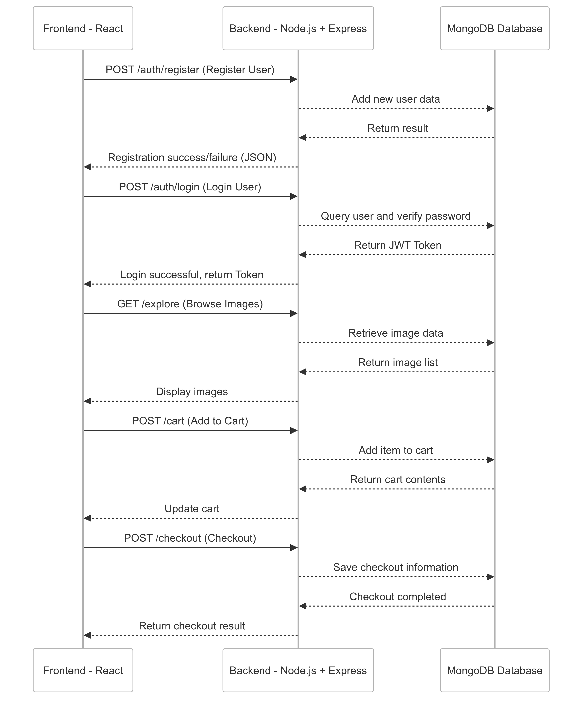

# ViviPix

VividPix is a platform dedicated to selling high-quality images. Users can register an account, browse images, search for specific themes, add images to their cart, and complete the checkout process. 

The website is designed to provide users with a clean and intuitive shopping experience.

- **Key Features**：
    - Users can log in to view their purchase history and personal profile.
    - Supports keyword-based image search, such as "cat," "dog," etc.
    - Easy-to-use shopping cart and checkout system.
    - **TapPay Payment Integration**: Enables secure and fast credit card transactions, providing users with a seamless checkout experience.

---

## Live Demo

- **Website**: [**http://52.195.128.175:3000/**](http://52.195.128.175:3000/)
- **Test Account:**
    - **Email**: [**giraffe@zoo.com**](mailto:giraffe@zoo.com)
    - **Password**: 123456
- **Test Credit Card Info** (provided by **TapPay**):
    - **Card Number**: 4242 4242 4242 4242
    - **Expiry Date**: 12/26
    - **CVV**: 123

---

## Search Functionality

Users can search for images by entering **English keywords**. Below are a few examples of search results:

- **Search Examples：**
    - **Keyword: cat**
        
        Displays images related to cats, such as adorable house cats, playful kittens, or cats sitting by the window.
        
    - **Keyword: family**
        
        Displays images related to family, such as warm family portraits, parents playing with their children, or cozy holiday scenes.
        
    - **Keyword: nature**
        
        Displays images of nature, such as breathtaking mountain views, streams in forests, or sunsets over beaches.
        

---

## Frontend and Backend Workflow

---

## TapPay Payment Integration

This project integrates **TapPay API** to handle payment processing, ensuring secure and efficient credit card transactions.

 Key features include:

1. **Secure Payments**: Uses token-based payment validation to ensure privacy and security during transactions.
2. **Test Mode**: Provides test credit card numbers for validating the payment workflow during development.
3. **Payment Flow**:
    - Users confirm items in their cart and proceed to the checkout page.
    - They input credit card information and submit it.
    - The backend validates the payment details through TapPay API and returns the result (success/failure).
    - On success, a transaction record is created; on failure, the user is prompted to retry.

---

## **Technologies Used in Frontend and Backend**

### **Frontend**

- **Framework**: React.js
- **State Management**: React State
- **Routing**: React Router
- **Styling**: Bootstrap 5, SCSS
- **Frontend API Requests**: Fetch API / Axios
- **Component Design**: Modular component design (e.g., `Home`, `Cart`, `Login`, etc.)

### **Backend**

- **Server Framework**: Node.js + Express.js
- **Authentication System**: JWT (JSON Web Token)
- **API Routing**: RESTful API design (e.g., `/auth`, `/cart`, `/checkout`)
- **Database**: MongoDB (using Mongoose as the ODM tool)
- **Environment Management**: dotenv for managing `.env` files
- **Error Handling**: Middleware-based error handling mechanism

### **Development Tools**

- **Version Control**: Git / GitHub
- **Package Management**: npm
- **Deployment**: AWS EC2
- **Payment Testing**: Stripe Test Card